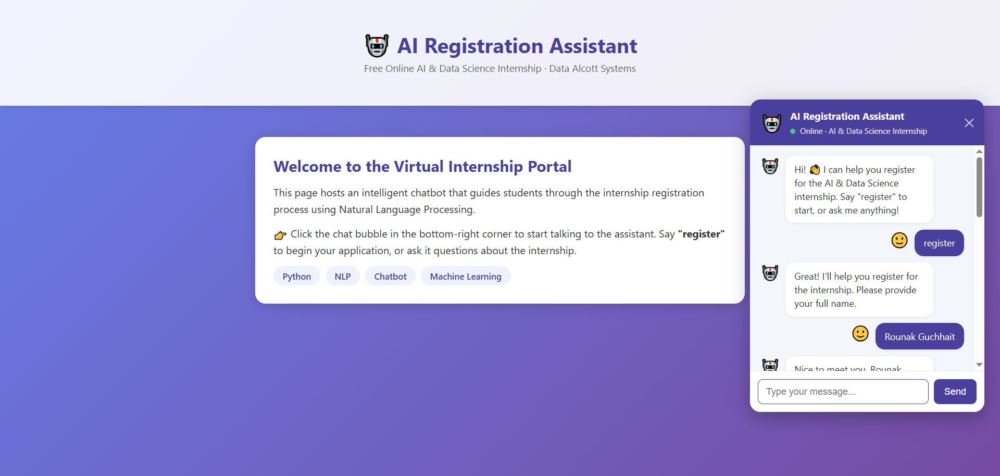
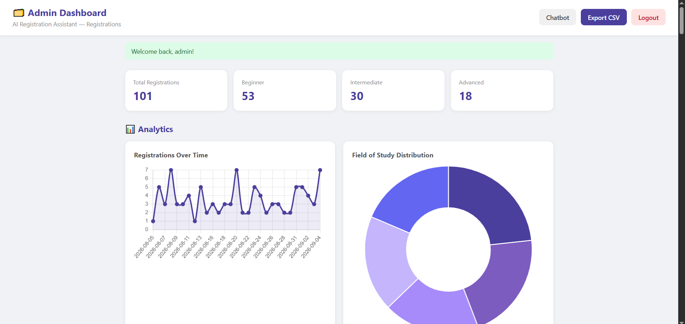

# AI Registration Assistant

An intelligent chatbot that guides students through the internship registration process using **Natural Language Processing** and **Conversational AI**.

## 🚀 Live Demo

Try the chatbot live — no setup required:

**[https://ai-registration-assistant-xg6k.onrender.com](https://ai-registration-assistant-xg6k.onrender.com)**

> Note: It may take 30-60 seconds to wake the app. Just wait a moment for it to load.





## Features

- **Intent Recognition** - Trained ML model (Naive Bayes + TF-IDF) classifies user queries
- **Entity Extraction** - Extracts name, email, field of study, and experience level from free text
- **Dialog Management** - State-based conversation flow (greet → collect info → confirm)
- **Validation Checks** - Email format validation with automatic re-prompts
- **Registration Storage** - Saves completed registrations to `registrations.json`
- **Sentiment Analysis** - Detects positive/negative/neutral user tone
- **FAQ Handling** - Answers questions about the internship, required skills, and the process
- **Web Interface** - Floating chat bubble widget (like Amazon's corner chatbot)
- **Admin Dashboard** - Protected panel to view, search, delete, and export registrations with analytics

## Technology Stack

- **Python**
- **NLTK** - Text preprocessing, tokenization, lemmatization
- **Scikit-learn** - Machine learning intent classifier
- **Flask** - Web interface

## Project Structure

```
ai-registration-assistant/
├── app.py              # Flask web server + chat API
├── chatbot.py          # Core chatbot logic (NLP + dialog management)
├── admin.py            # Admin dashboard routes (login, table, analytics)
├── intents.json        # Intent patterns and responses
├── requirements.txt    # Python dependencies
├── templates/
│   ├── index.html     # Webpage with chat bubble widget
│   ├── admin_login.html   # Admin login page
│   └── admin_dashboard.html # Admin dashboard
└── static/
    ├── style.css       # Chat widget styling
    ├── admin.css       # Admin dashboard styling
    └── script.js       # Chat widget front-end logic
```

## Getting Started

### Prerequisites

- Python 3.8 or higher
- Git (optional)

### Setup & Run

```bash
# 1. Clone the repository
git clone <your-repo-url>
cd ai-registration-assistant

# 2. Install dependencies
pip install -r requirements.txt

# 3. Run the Flask app
python app.py
```

Then open your browser at **http://127.0.0.1:5000**

Click the **chat bubble** in the bottom-right corner and say **"register"** to start.

### Running as a terminal chatbot (optional)

```bash
python chatbot.py
```

## Usage Example

```
You: hello
Bot: Hello! Welcome to the internship registration. How can I help?

You: I want to register
Bot: Please provide your full name.

You: My name is Rounak Guchhait
Bot: Nice to meet you, Rounak Guchhait! Next, your email address.

You: cserounak@gmail.com
Bot: Your email is recorded. What's your field of study?

You: Computer Science
Bot: What's your programming experience?

You: Beginner
Bot: Let me confirm your registration.

You: yes
Bot: Registration confirmed! 🎉
```

## Admin Dashboard

After registering students through the chatbot, view and manage all applications at:

```
/admin
```

- **Demo credentials:** username `admin`, password `admin123`
- View all registrations in a table (name, email, field, experience, date)
- **Search** records by name, email, field, or experience
- **Delete** unwanted records
- **Export** all data as a CSV file
- See **analytics** cards summarizing total registrations and top fields

> ⚠️ This is a lightweight demo authentication.

## How It Works

1. **Preprocessing** - User input is lowered, cleaned, tokenized, and lemmatized (NLTK)
2. **Intent Classification** - Scikit-learn Naive Bayes classifier (trained on `intents.json` patterns) determines intent, with rule-based fallback
3. **Entity Extraction** - Regex extracts structured data (name, email, etc.)
4. **Dialog Management** - A state machine drives the conversation through the registration flow
5. **Validation & Storage** - Inputs are validated and completed registrations are saved

## Notes

- No database required - registration data is stored in a simple JSON file
- NLTK resources (`punkt`, `stopwords`, `wordnet`) auto-download on first run

## Author

**Rounak Guchhait**
